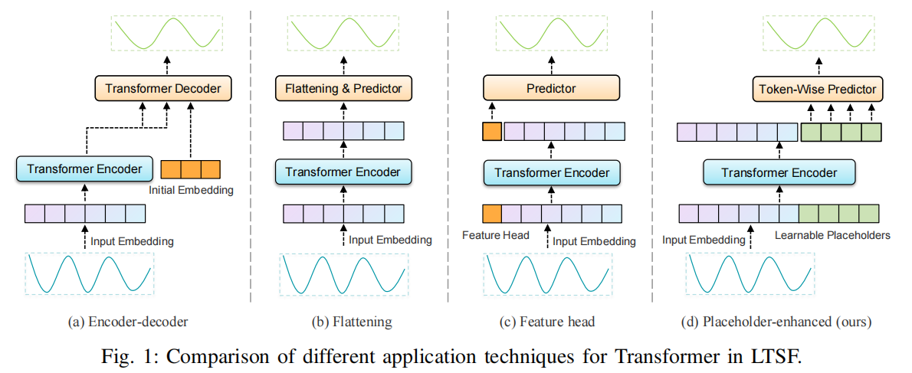
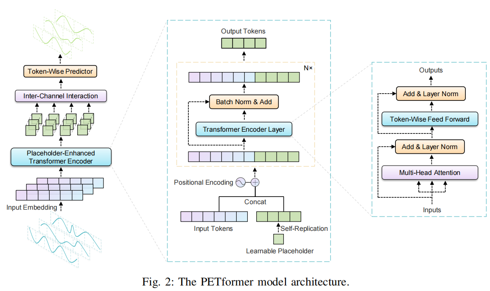
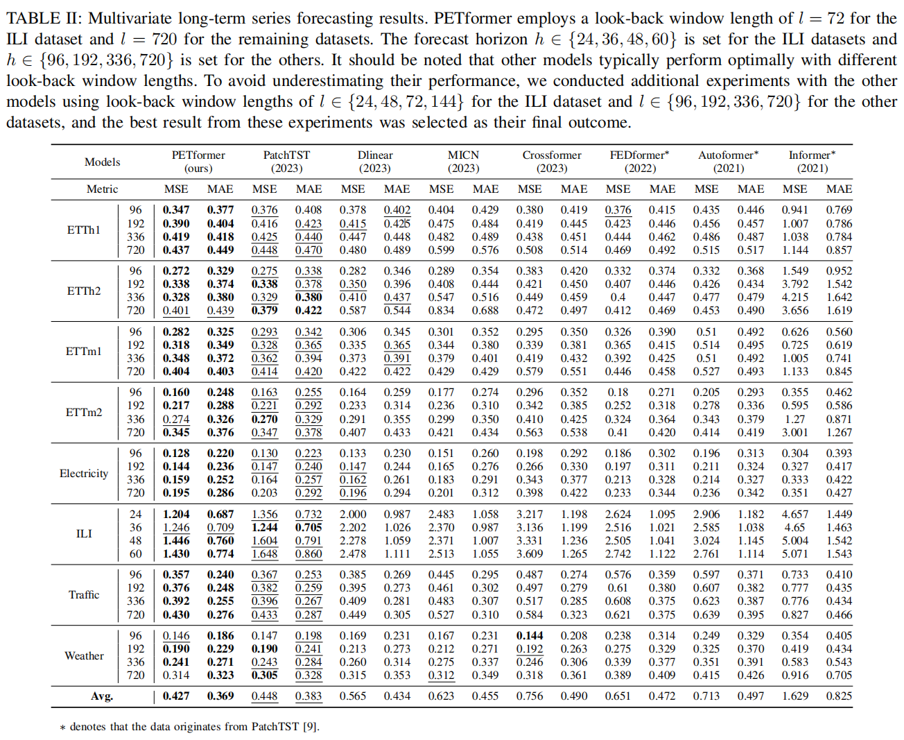

# PETformer

Welcome to the repository of PETformer: "PETformer: Long-term Time Series Forecasting via Placeholder-enhanced Transformer."

## Updates
🚩 **News** (2024.11): PETformer has been accepted by IEEE Transactions on Emerging Topics in Computational Intelligence (TETCI).

## Introduction

This paper proposes the Placeholder-enhanced Technique (PET) to boost the computational efficiency and predictive accuracy of Transformers in long-term time series forecasting (LTSF) tasks.



The PET architecture employs a **shared learnable placeholder** that occupies the output window to be predicted. This placeholder is fed into the Transformer encoder for feature learning.



The PET structure introduces an extremely lightweight token-wise prediction layer design, significantly reducing the number of learnable parameters. 
Compared to the flattening strategy of PatchTST, PETformer's prediction layer reduces the required parameters from `n * d_model * h` to `d_model * w`.



## Getting Started

### Environment Requirements

To get started, ensure you have Conda installed on your system and follow these steps to set up the environment:

```
conda create -n PETformer python=3.8
conda activate PETformer
pip install -r requirements.txt
```

### Data Preparation

All the datasets needed for PETformer can be obtained from the [Google Drive](https://drive.google.com/drive/folders/1ZOYpTUa82_jCcxIdTmyr0LXQfvaM9vIy) provided in Autoformer. Create a separate folder named ```./dataset``` and place all the CSV files in this directory.

### Training Example

You can easily reproduce the results from the paper by running the provided script command. For instance, to reproduce the main results, execute the following command:

```
sh run_main.sh
```

Similarly, you can reproduce the results of the ablation learning by using other instructions:

```
sh run_ablation_placeholder.sh
```

Additionally, you can specify separate scripts to run independent tasks, such as obtaining results on ethh1:

```
sh script/PETformer/etth1.sh
```

## Citation
If you find this repo useful, please cite our paper.
```
@article{lin2023petformer,
  title={Petformer: Long-term time series forecasting via placeholder-enhanced transformer},
  author={Lin, Shengsheng and Lin, Weiwei and Wu, Wentai and Wang, Songbo and Wang, Yongxiang},
  journal={arXiv preprint arXiv:2308.04791},
  year={2023}
}
```

## Acknowledgement

We extend our heartfelt appreciation to the following GitHub repositories for providing valuable code bases and datasets:

https://github.com/yuqinie98/patchtst

https://github.com/cure-lab/LTSF-Linear

https://github.com/zhouhaoyi/Informer2020

https://github.com/thuml/Autoformer

https://github.com/MAZiqing/FEDformer

https://github.com/alipay/Pyraformer

https://github.com/ts-kim/RevIN

https://github.com/timeseriesAI/tsai
